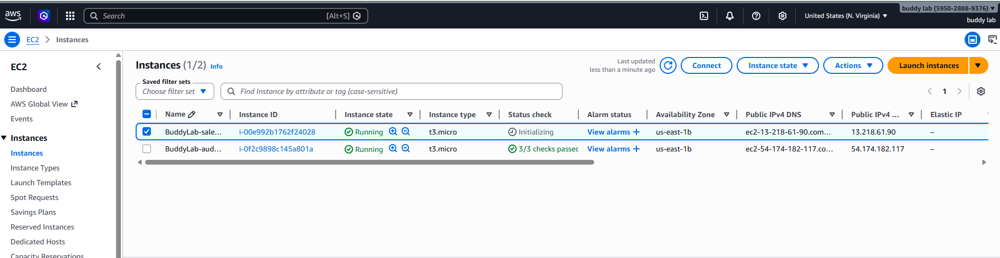
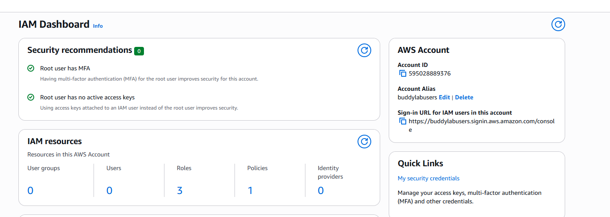
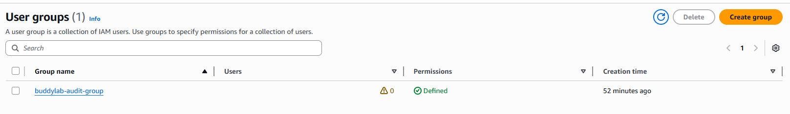
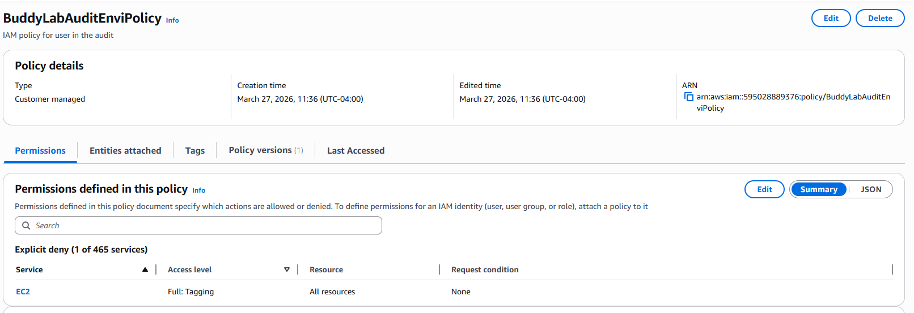
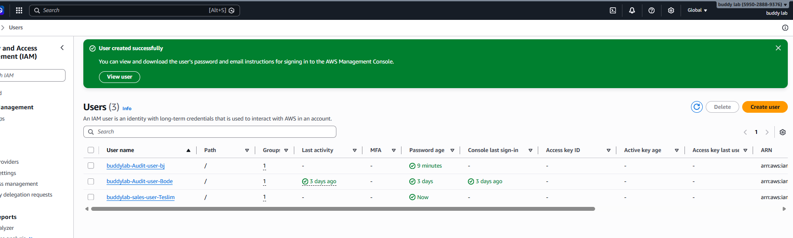
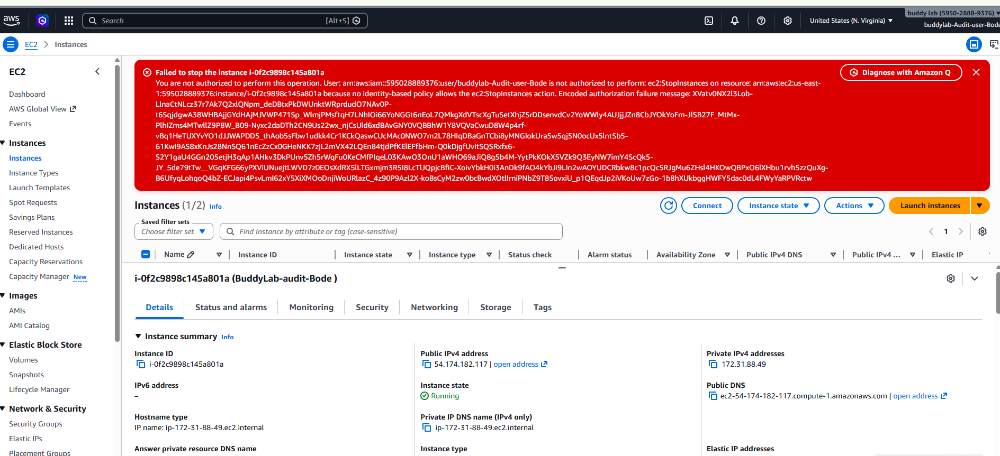
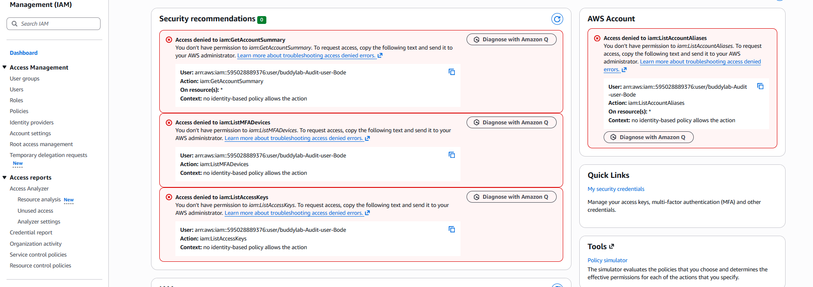

# AWS Cloud Console Deployment & IAM Hardening

Configuration and hardening of cloud console access in AWS, built around a least-privilege IAM policy tested against two EC2 instances.

## Objective

Implement least-privilege access control in AWS Identity and Access Management (IAM): create a custom policy that explicitly denies EC2 start/stop actions on a sensitive "audit" instance while allowing them on a "sales" instance, then verify the policy holds under direct testing.

## Environment & Tools

- **AWS Free Tier** — IAM, EC2
- Two t3.micro EC2 instances: `BuddyLab-audit` and `BuddyLab-sales`
- IAM users, groups, and a customer-managed JSON policy
- Account alias set to a memorable sign-in URL (`buddylabusers`) for easier team login

## Methodology

1. **Tagging strategy** — Tagged each EC2 instance descriptively for policy targeting:

   | Instance | Tag Key | Tag Value |
   |---|---|---|
   | BuddyLab-audit | Environment | Audit |
   | BuddyLab-sales | Environment | Sales |

2. **Custom IAM policy** — Authored a JSON policy (`BuddyLabAuditEnviPolicy`) with an explicit `Deny` on `ec2:StopInstances` / `ec2:StartInstances` scoped to the audit instance, while leaving the sales instance unrestricted.
3. **Account alias** — Replaced the default numeric account URL with a memorable alias (`buddylabusers`) to simplify sign-in for IAM users.
4. **Users & groups** — Created an IAM user group (`buddylab-audit-group`), attached the custom policy, and added individual IAM users (`buddylab-Audit-user-Bode`, `buddylab-Audit-user-bj`, `buddylab-sales-user-Teslim`) requiring controlled EC2 access.
5. **Sign-in path** — Verified IAM users could authenticate through the AWS Management Console using the new alias URL.
6. **Policy testing** — Logged in as a restricted IAM user and directly tested the policy against both instances.

## Findings / Results

| Test Action | Expected Result | Actual Result |
|---|---|---|
| Stop audit instance | Denied | Access denied error displayed |
| Stop sales instance | Allowed | Instance stopped successfully |
| Start audit instance | Denied | Access denied error displayed |
| Start sales instance | Allowed | Instance started successfully |

The audit user was also confirmed to lack broader account-level visibility — `iam:ListGroups`, `iam:GetAccountSummary`, `iam:ListMFADevices`, `iam:ListAccessKeys`, and `iam:ListAccountAliases` all correctly returned access-denied, confirming the least-privilege boundary held beyond just the EC2 actions it was designed to restrict.

*AWS Management Console — starting point for the lab environment.*

*Two tagged EC2 instances: BuddyLab-audit and BuddyLab-sales.*

*IAM dashboard showing the custom account alias and resource summary.*

*buddylab-audit-group created for scoped policy assignment.*

*BuddyLabAuditEnviPolicy — explicit deny on EC2 tagging/start-stop actions for the audit environment.*

*Three IAM users provisioned with individual console credentials.*

*Attempted stop on the audit instance correctly denied by policy.*

*Confirmed the restricted user also lacks account-level IAM visibility (ListGroups, GetAccountSummary, ListMFADevices, ListAccessKeys, ListAccountAliases).*

## Key Takeaways

This project demonstrates practical application of the principle of least privilege in a cloud environment: scoping a policy narrowly by resource tag rather than broadly by service, and validating the control through direct negative and positive testing rather than assuming intent matches configuration. The account-level access-denied results were incidental but reinforced that the policy boundary was tighter than the single use case it was written for — a useful habit when reviewing IAM policies in production.
